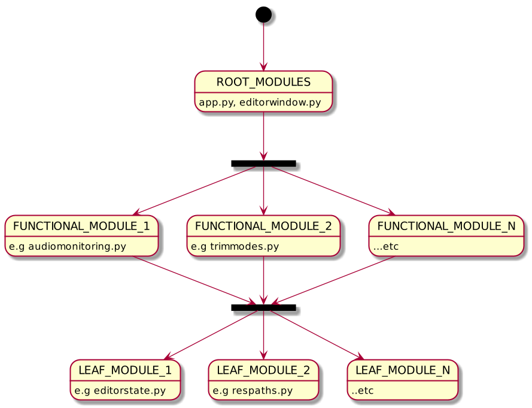
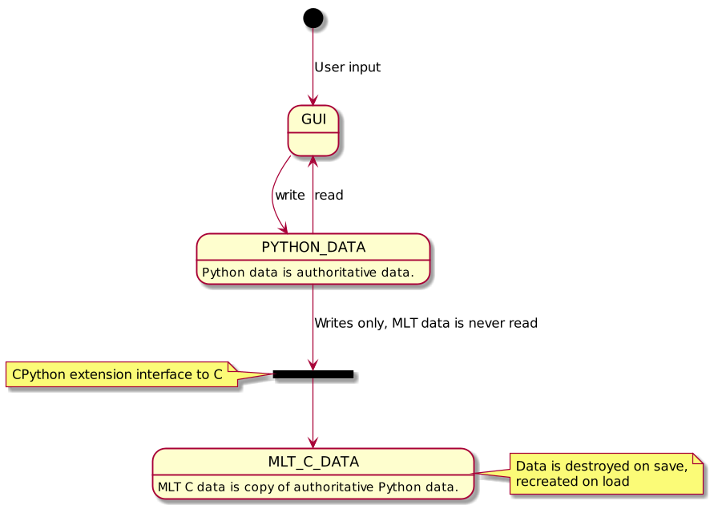
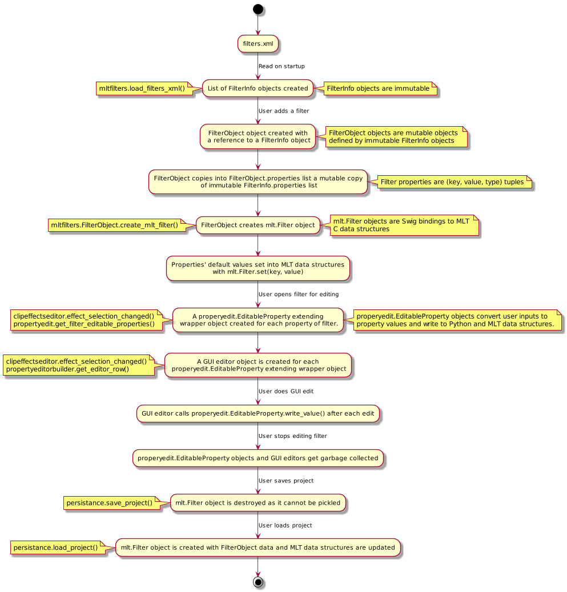
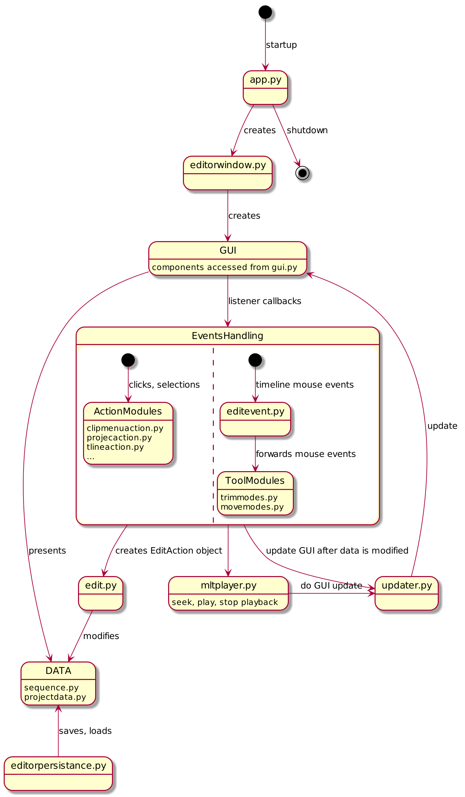

# Flowblade Codebase Overview

## 1. Introduction

This document aims to give a quick overview of Flowblade code base.

Instead of trying to explain everything we focus on large fundamental structures and intentions present in the code base, it can be much easier to understand individual parts of functionality if the larger framework is known.

Particular attention is given to intentions behind taken design decisions. Taken approaches are not standart OO or MVC structures and may not present themselves to new students of the code base as clearly as one would like.

Diagrams are created with PlantUML Ubuntu package from the text files present in this directory.

Chanpter 2. "Viewpoints" presents different points of view into the code base and Chapter 3 "Conclusions" gives some opinions on current state and future directions.

## 2. Viewpoints

### 2.1 Module design

The main approach to structuring the Flowblade code base is simply that **modules are considered to be divided into three categories** based on number of *internal* modules they import:
  * **Root Modules** import a large part of total number of modules
  * **Functional Modules** import all modules required achieve the function
  * **Leaf Modules** only import external modules (which offer clear defined interface and do not make the code base structurally more complex)

The goal of the design is to have the maximum amount of code in the Leaf Modules and to have as little as possible interdependence between Functional Modules.

Each new clearly defined functionality should be added by creating a new module and connecting it in root modules to GUI callbacks and elsewhere into some existing main paths in the application. Example: When timeline sensitive cursor was introduced most of the new functionality was contained in module *snapping.py* that was imported by 3 other modules as needed.

  Other points:
  * Each module differentiates between *module_interface_functions()* and *_internal_functions()* with interface functions in the beginning of the module.
  * *Success:* A lot of functionality is achieved by importing leaf modules
  * *Failure:* The import structures in Functional Modules remains complex and do not present any clear structure.
  * *Success:* We rarely get regressions when adding new functionality or fixing bugs.

### 2.2 Data Structures

Flowblade maintains at all times two 100% synced data structures: Python data structures that are mainly described in *sequence.py* and *projectsdata.py* and MLT data structures that are managed via Swig objects described in extension *mlt.py*

Python data structures are considered authoritative over MLT data structures.

User edits Python data structures. GUI presents view into Python data structures *except* with monitor view which displays the output of MLT tractor producer.

Python data structures are copied into MLT data structures that create the viewable and renderable media output. MLT data structures are destroyed on save and recreated on load.

Since we are keeping two data structures at all times 100% synced we need to take extra care that at no point do the data structures deviate. This is done by constraining writing to both data structures into very few code locales, main ones being:
* *edit.py* lines 50 - 90 (marked *atomic edit ops*)
* *propertyedit.EditableProperty.write_value()*
* *propertyedit.TransitionEditableProperty.write_value()*

The reasoning behind the approach:
* constraining access to MLT data structures and separating clearly Python and MLT data structures was considered cleaner and more maintainable then an approach in which the line of separation would be unclear between the two data structures
* about 50% less Python FFI calls
* save and load using *picle()* requires this

### 2.3 Filter editing Pipeline

The conceptual approach taken in filter editing related code is to view the whole process as a data modifying **pipeline.**

This rather long diagram shows the individual steps,
* we start from filters data described in *filters.xml* doc
* ...this data is transformed into immutable objects
* ...those immutable object used to describe properties of mutable objects
* ...wrapper objects are created to translate user inputs into property data in mutable objects
* ...data is copied into MLT data structures

This approach some quite nice qualities: we have received maybe 2 bug reports of 670+ filed against this close to 10K line portion of the program.

The downside is very likely that the code communicates quite badly this approach of a data pipeline, successive steps are in different modules and the code comments remain inadequate.

For anyone interested in understanding this functionality the best thing to do would probably be to go through the diagram above while reading the related code (which is given in the notes on the left, notes on the right give some additional information on each step).

### 2.4 Minimal Viable Diagram

This diagram attempts to show the smallest possible view describing application life cycle and main editing actions.
* *smalltext.py* names are Python modules
* *LARGE_TEXT* names show conceptually categorized code blocks
* *named arrows* give the types of interaction between the objects in the diagram

## 3 Conclusions

### 3.1 Current state of code base

The question to ask here is if we need to refactor this program or not? The answer in my view is no.

We have been able to add new features and fix bugs with low level of regressions. The level of regressions we get is certainly below what would necessitate trying to modularize application further and to try to write a comprehensive enough test suit to combat regressions.

Often the  defense against regressions is writing application in style where unnecessary structure is avoided and interconnections between modules is knowingly avoided if at all possible. From maintainability point of view it is better to be boring then clever.

### 3.2 Future directions

There are number of ways we could look to improve the code base structurally:
* drop as much as possible code into Leaf Modules
* remove imports from modules by creating new smaller modules with fewer or zero (internal) imports
* *editorstate.py* could made smaller by taking same multimodule state into smaller modules like maybe *monitorstate.py* and leaving only the truly global state in *editorstate.py*
* improve code comments
* expand this document with some further view points
* because Python does not have multi-module package structure dividing modules in multiple folders would only be done for readability reasons but this can be considered down the line

We accept correct pull requests against this document. You can suggest expansions on areas you feel could use further clarification by creating a GitHub *Issue.*
